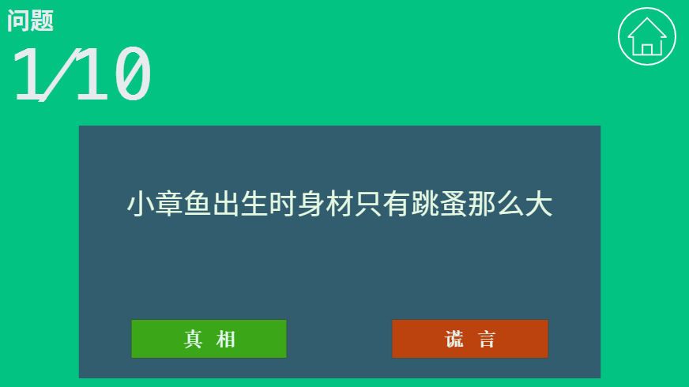

# TrueOrFalse

这是一个练习项目,帮助我更好地理解和使用React,游戏受Steam上的[TrueOrFalse](http://store.steampowered.com/app/521340/)游戏的启发,模仿其逻辑做了一个小练习.

## Play Online

[Click here!](http://drgao.xyz/TrueOrFalse/)

如果你喜欢,可以在Steam找到他,是完全免费的哦,其中有更多有意思的题目.
